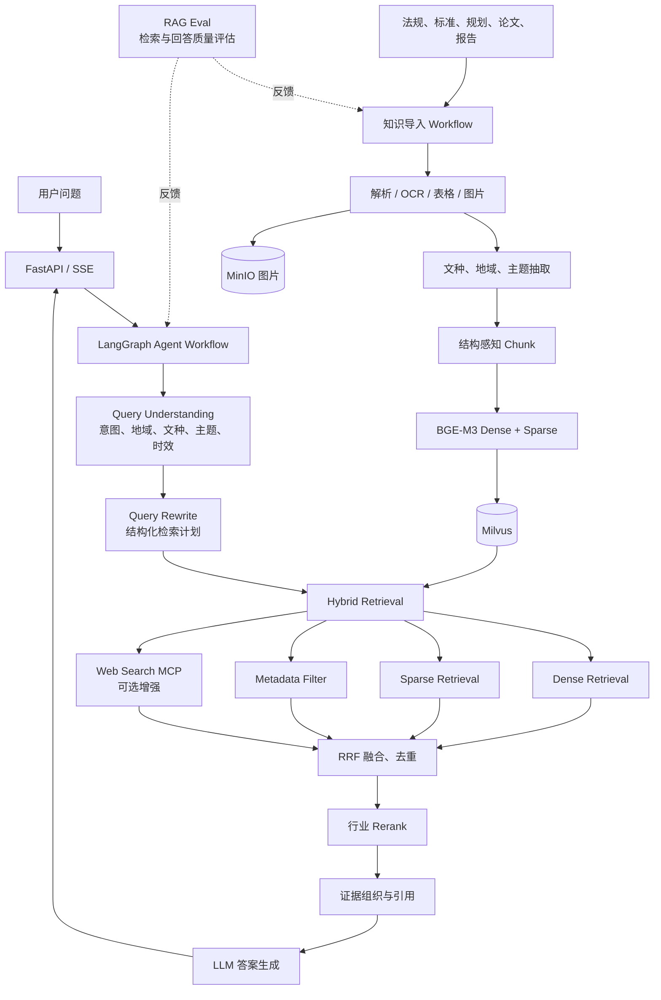

# rewater-agent 架构说明

## 1. 当前代码架构

本节只描述仓库中可以确认的现状，不代表最终业务架构。

### 1.1 分层

```text
HTTP API
  └─ app/api/http
       ↓
LangGraph 流程与节点
  └─ app/process/import_、app/process/query
       ↓
RAG 领域服务
  └─ app/rag/import_、app/rag/query
       ↓
基础设施适配
  └─ app/infra
       ↓
底层客户端、模型与配置
  └─ app/shared
```

### 1.2 当前导入流程

```text
Upload
  → 文件类型识别
  → PDF 使用 MinerU 转 Markdown（MD 直接进入下一步）
  → 图片摘要与 MinIO 上传
  → Markdown 标题/字符长度切分
  → 商品主体识别并写入主体集合
  → BGE-M3 dense+sparse embedding
  → Milvus chunks 集合
```

### 1.3 当前查询流程

```text
用户问题 + MongoDB 历史
  → LLM 提取 item_names 并改写问题
  → Milvus 商品主体对齐
  → 普通混合检索 / HyDE 检索 / Web Search
  → RRF
  → BGE Reranker
  → LLM 生成答案
  → SSE、MongoDB 历史和图片 URL
```

### 1.4 当前架构问题

- 查询节点与 service 的函数名、返回值契约存在漂移，当前查询链路不是稳定基线。
- 领域模型以商品 `item_name` 为核心，不适合再生水行业多维知识。
- RRF 实际只融合普通检索与 HyDE，Web 结果在 rerank 阶段直接加入。
- 任务和 SSE 状态保存在进程内，适合当前单实例应用，但需要生命周期清理和异常恢复。
- 导入缺少可靠的失败处理与索引一致性保障。
- `shared` 和 `infra` 存在部分职责重复，配置出口不统一。

## 2. 目标再生水 Agent 架构

下图是当前阶段的目标核心架构，不表示对应模块已经实现。它聚焦 Agent Workflow、行业 RAG、混合检索和工程质量，不展开企业 SaaS 能力。



### 2.1 目标逻辑分层

1. 接入层：FastAPI、SSE 和简单交互页面。
2. Agent 编排层：意图路由、检索规划、可选工具调用和回答策略。
3. RAG 能力层：分类、Query Rewrite、Hybrid Retrieval、RRF、Rerank 和证据组织。
4. 知识导入层：解析、行业 metadata 抽取、结构感知切分、Embedding 和索引。
5. 基础设施层：LLM、BGE-M3、Reranker、Milvus、MinIO、MinerU、配置与日志。
6. 评估层：检索质量、引用正确性、回答忠实度、延迟和成本评估。

### 2.2 目标 Agent 能力

- 按用户问题自动识别地域、文档类型、专业主题和时间范围。
- 判断应使用法规、标准、规划、论文或报告中的哪类证据。
- 对多份标准或不同地区政策执行对比检索。
- 在证据不足、地域不明确或文件已失效时主动澄清。
- 输出带文档、章节、页码、发布日期和效力状态的可追溯回答。
- 对法规效力冲突、标准替代关系和多来源结论进行提示。
- 后续可增加标准指标核查、专题资料汇总等工具；具体工具清单待确认。

## 3. 模块重构映射

| 当前模块 | 处理方式 | 目标方向 |
|---|---|---|
| `process/import_/agent` | 保留图框架，重构节点 | 增加分类和 metadata 抽取节点 |
| `process/query/agent` | 保留图框架，重写入口路由 | 从商品确认改为行业意图与检索规划 |
| `rag/import_/item_name_service.py` | 替换 | 行业文档分类与 metadata 抽取服务 |
| `rag/query/item_name_confirm_service.py` | 替换 | 地域/主题/文种/时效识别及 Query Rewrite |
| `rag/import_/split_service.py` | 重构 | 法规条款、标准章节、论文结构和表格感知切分 |
| `rag/import_/embedding_service.py` | 保留并调整 | metadata-aware 文本构造、失败重试和批处理 |
| `rag/import_/index_service.py` | 重构 | 行业 Schema、可靠写入和 metadata 过滤 |
| `rag/query/search_*` | 保留模式，重构过滤维度 | Dense/Sparse/结构化多路检索 |
| `rag/query/rrf_service.py` | 修复并扩展 | 统一融合多路来源并允许单路降级 |
| `rag/query/rerank_service.py` | 保留并校准 | 使用行业评测集校准模型、Top-K 和阈值 |
| `rag/query/answer_output_service.py` | 重构 Prompt 和证据格式 | 强制引用、有效性提示和不确定性表达 |
| `infra/*` | 大体保留并强化 | 超时、重试、基础日志和清晰配置 |
| `rag_eval/*` | 保留框架、替换数据 | 建设再生水行业评测集与指标 |
| 商品 Prompt 和 HAK180 数据 | 迁移完成后删除 | 替换为行业 Prompt、样本和评测资产 |

## 4. 架构边界原则

- Agent 节点负责流程和路由，不承载大段业务实现。
- RAG service 返回契约必须统一为“纯结果”或“state 增量”，不可混用。
- metadata 是行业检索的一等数据，不应只拼入正文做向量检索。
- 文档原文、基础来源 metadata 和向量索引必须可以互相追溯。
- 联网搜索只能作为受控补充来源，不能无标记地混入正式行业依据。
- 答案必须区分事实证据、模型归纳和建议性内容。
- 删除旧商品逻辑之前必须存在对应的新链路和回归测试。

## 5. 未来规划（不属于核心架构）

只有在核心 Agent 与 RAG 能力稳定、且出现真实需求时，再评估以下方向：

- 用户认证和 RBAC 权限；
- 多租户；
- 完整的文档版本管理；
- 人工审核与发布流程；
- 长期 Memory 系统；
- 企业级监控平台；
- 多实例任务系统和复杂消息队列。

这些能力不应阻塞当前 Agent Workflow、行业 RAG 和工程化基线建设。

